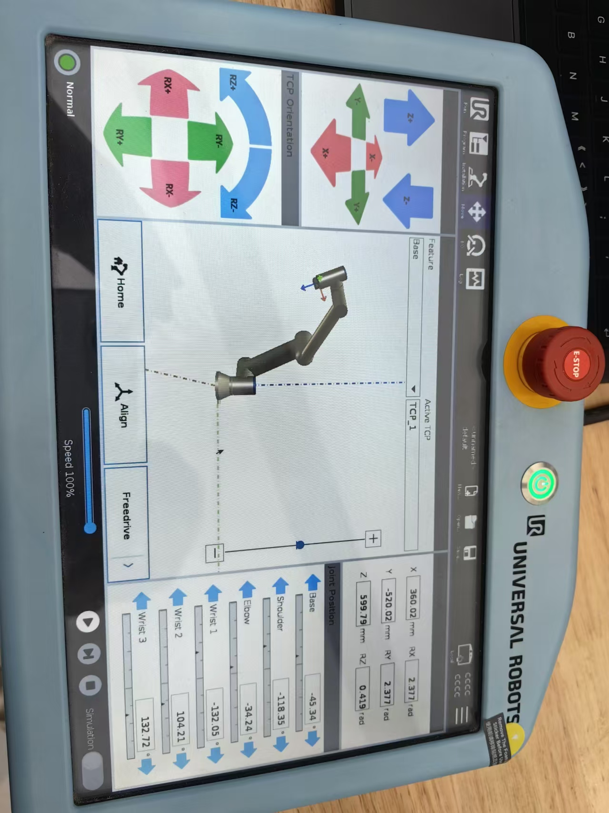
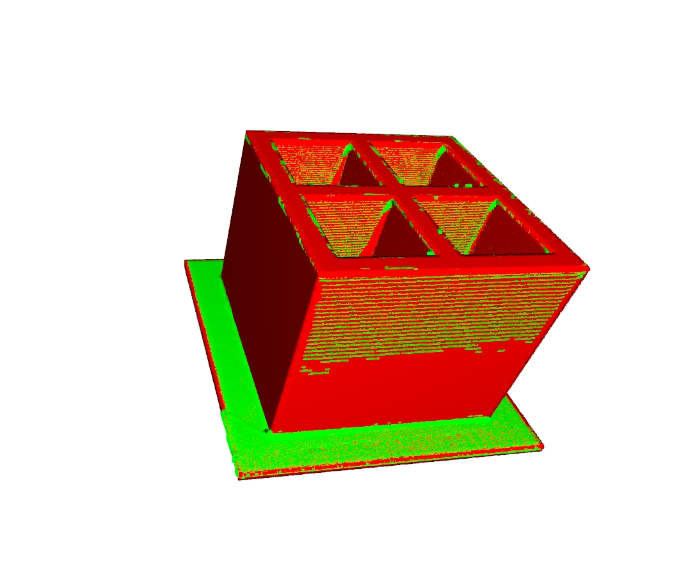

# Point Cloud Fusion and Localization

## Overview
This project implements the fusion and localization of multiple point clouds, primarily using the Open3D library for point cloud data processing. It reads multiple PLY files, creates transformation matrices, performs normal estimation, outlier removal, feature computation, registration, and ultimately merges the point clouds into a single complete point cloud.

## Dependencies
- Python 3.10.10
- Open3D

## Installation
You can install Open3D using pip:
```bash
pip install open3d
```

## Usage
<div style="text-align: center;">
    
</div>


1. **Prepare Point Cloud Data**: Ensure you have the point cloud files in the `sourcePLY` directory, formatted as PLY.
2. **Set the Hand-Eye Calibration Matrix**: Adjust the `translation_camera` variable in the code to match your specific device configuration.
3. **Run the Code**: Execute the Python script to perform point cloud fusion and localization.
```bash
python ./localization.py
```
4. **View Results**: The fused point cloud will be displayed in an Open3D visualization window after the script runs.

## Features
- **Read Point Cloud Files**: Supports reading multiple PLY format point cloud files.
- **Create Transformation Matrix**: Generates transformation matrices using translation and rotation.
- **Normal Estimation and Outlier Removal**: Estimates normals for point clouds and removes outliers using plane segmentation and statistical filtering.
- **Feature Computation**: Computes FPFH features for downsampled point clouds for registration.
- **Registration Algorithms**: Utilizes Fast Global Registration (FGR) and Generalized ICP for fine point cloud alignment.
- **Final Fusion**: Merges all processed point clouds and outputs the result.

## Results
The fused point cloud will be displayed in an Open3D visualization window. Parameters can be adjusted to achieve better results as needed.

<div style="text-align: center;">
    
</div>

## Contributing
Yujie ZHOU  yzhou118@connect.hkust-gz.edu.cn

## License
Information about the license for this project (if applicable).
```
Null